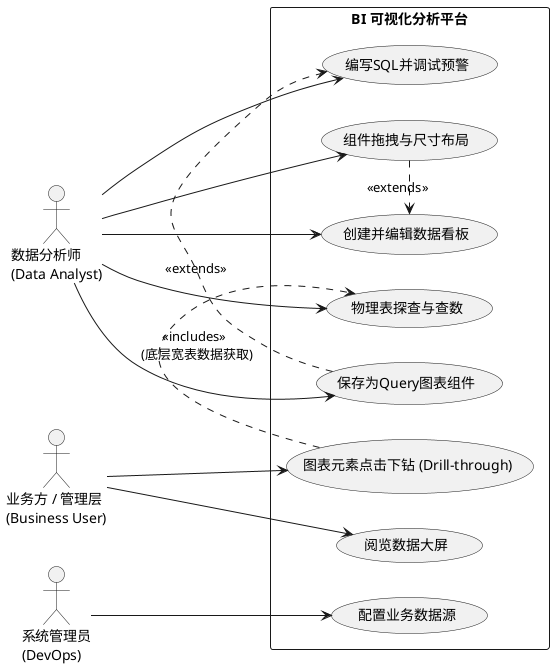
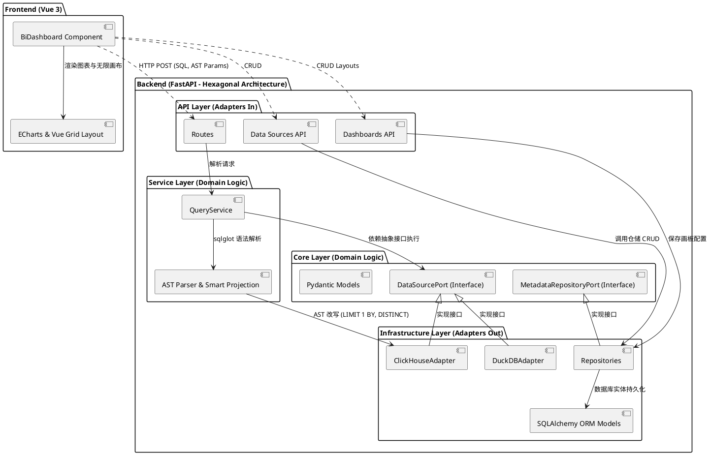
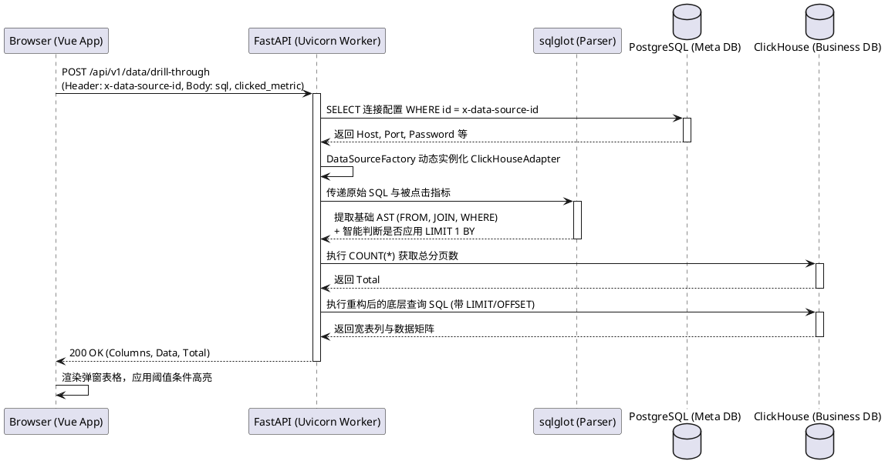
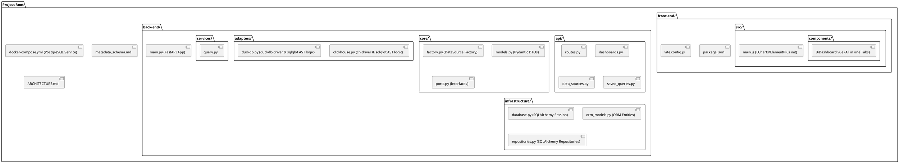
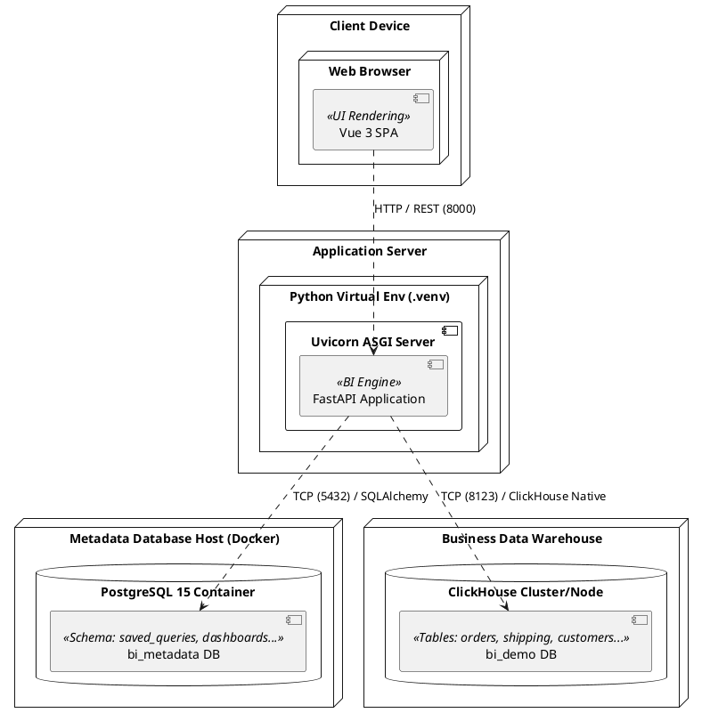

# 数据分析控制台 4+1 视图架构 (4+1 Architectural View Model)

本文档使用 4+1 视图模型，结合 PlantUML，全面且多维度地描述了本数据分析 BI 平台的架构设计。

> **规则约束**: 随着项目演进，任何涉及系统核心链路、部署拓扑、核心组件交互的修改，都必须同步更新此文档中的 PlantUML 模型。

---

## 1. 场景视图 (Scenarios / Use Case View)
**关注点**：系统提供给最终用户或外部系统的核心功能与价值。它是其他四个视图的核心驱动力。

---

## 2. 逻辑视图 (Logical View)
**关注点**：系统的功能需求抽象，主要展示系统的核心类、模型抽象以及业务逻辑的分层结构（特别体现后端的六边形架构设计）。

---

## 3. 进程视图 (Process View)
**关注点**：系统的动态运行行为，包括并发、进程通信、状态同步机制。展示前端触发查询到后端返回数据的异步请求链路。

---

## 4. 开发视图 (Development View)
**关注点**：代码在版本控制仓库中的物理组织形式，展现模块的分包和包之间的依赖关系。

---

## 5. 物理视图 (Physical / Deployment View)
**关注点**：系统的物理部署拓扑，展示软件组件是如何映射到硬件或容器环境中的。

