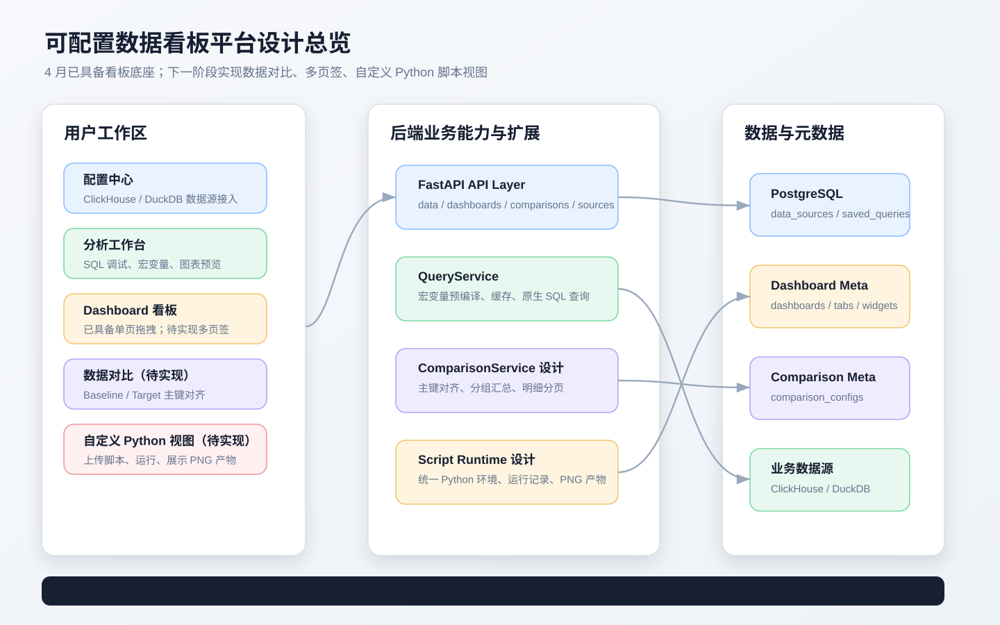
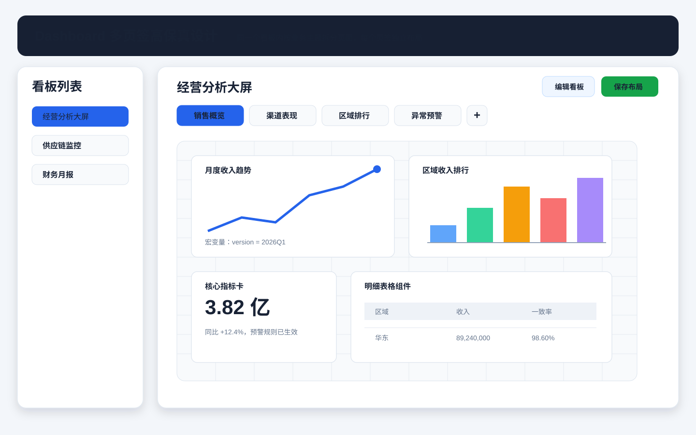
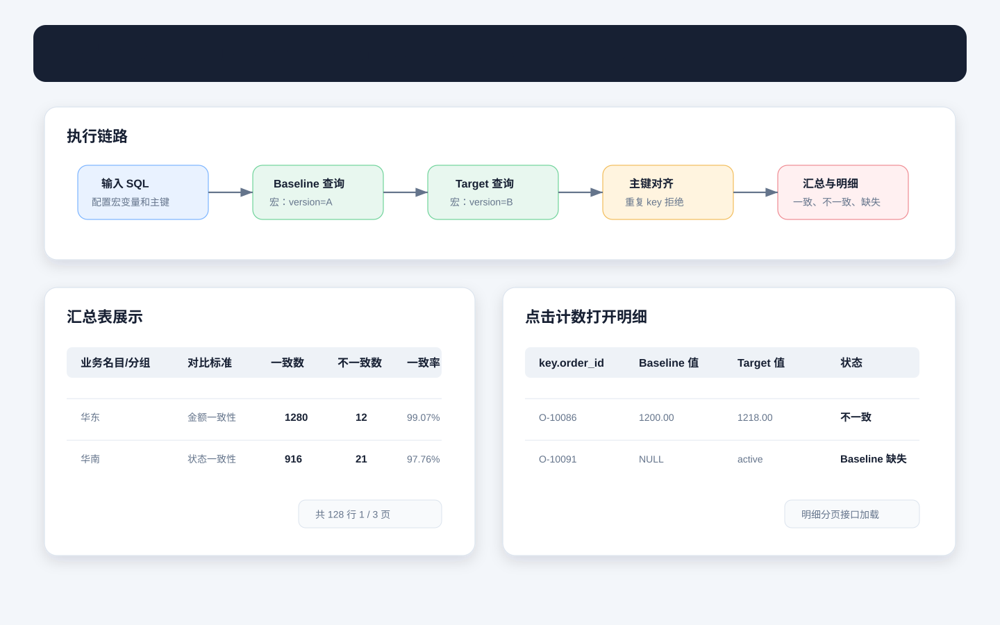
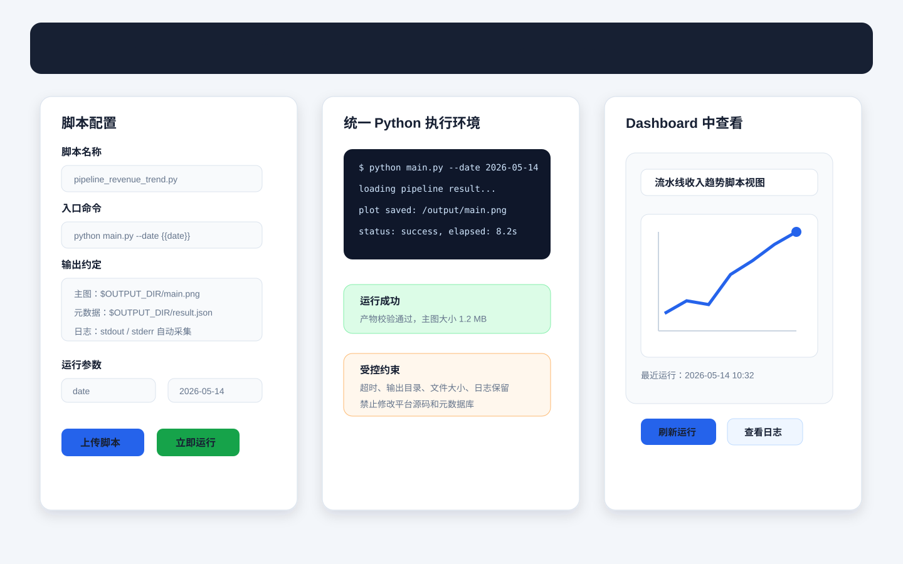
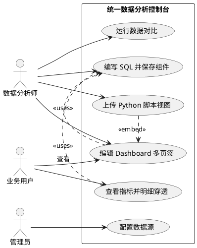
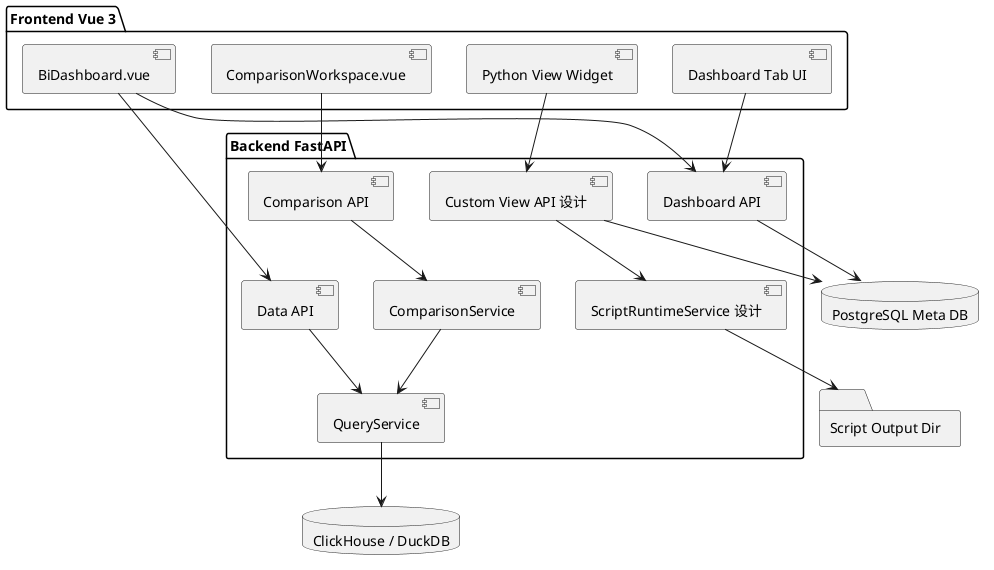

# 统一数据分析控制台设计文档

## 1. 需求背景 & 目标

### 1.1 背景
当前项目已经具备多数据源接入、SQL 分析工作台、可拖拽 Dashboard、智能明细穿透、数据对比和 Excel 导出等核心能力。系统目标用户是数据分析师、业务运营人员和内部系统管理员，典型工作流是先接入 ClickHouse / DuckDB 等业务数据源，再用 SQL 固化可复用查询组件，最后把组件编排到 Dashboard 中供业务查看。

现有能力解决了“查数、做图、下钻、对比”的主流程，但在实际使用中还会出现两类扩展诉求：

- 一个 Dashboard 需要承载多个业务主题，例如销售概览、渠道表现、异常预警，如果全部放在单一画布中会变得拥挤。
- 一些指标视图由本地 Python 脚本生成，例如读取多次流水线结果并生成折线图，希望低成本上传到平台并嵌入看板查看。

### 1.2 设计目标
- 建立一份面向产品、研发、测试和评审的统一设计文档，覆盖当前项目事实和后续扩展方案。
- 明确平台的信息架构、用户流程、核心模块职责、接口边界和测试用例。
- 将 Dashboard 多页签和自定义 Python 脚本视图作为完整设计项纳入文档。
- 用高保真图片描述关键页面，确保后续实现时界面和交互预期明确。

### 1.3 高保真总览



---

## 2. 需求整体分析

### 2.1 用户与核心场景

| 用户 | 核心诉求 | 对应功能 |
| :--- | :--- | :--- |
| 数据分析师 | 接入数据源、编写 SQL、调试口径、保存组件 | 配置中心、分析工作台、Saved Query |
| 业务用户 | 查看稳定报表、按主题切换页面、点击指标看明细 | Dashboard、多页签、智能下钻 |
| 数据质量 / 核算人员 | 比较 baseline 和 target 两批结果，定位差异 | 数据对比、汇总分页、明细弹窗 |
| 算法 / 工程人员 | 把已有 Python 指标脚本放到平台展示 | 自定义 Python 脚本视图 |
| 管理员 | 管理连接配置、控制脚本执行风险 | 数据源管理、运行约束、日志审计 |

### 2.2 竞品对比

| 维度 | Superset | Grafana | Metabase | Streamlit / 脚本平台 | 本项目定位 |
| :--- | :--- | :--- | :--- | :--- | :--- |
| SQL 分析 | 强，偏数据探索 | 中，偏时序查询 | 强，低门槛 | 依赖开发者实现 | 已支持原生 SQL、宏变量和保存查询 |
| Dashboard 编排 | 强，图表丰富 | 强，监控风格突出 | 中，面向业务自助 | 弱，需要手工开发 | 已支持拖拽网格和组件布局，后续支持多页签 |
| 下钻能力 | 有，依赖配置 | 有，偏链接跳转 | 有限 | 自定义开发 | 基于 sqlglot 做智能明细穿透 |
| 数据对比 | 非核心能力 | 非核心能力 | 非核心能力 | 可自定义但不标准 | 独立 ComparisonService，支持主键对齐和分组汇总 |
| 本地脚本上平台 | 不直接面向脚本产物 | 通过插件或外部图片 | 不直接支持 | 原生适合脚本 | 设计为上传 Python 脚本并输出 PNG 到 Dashboard |
| 扩展成本 | 体系完整但复杂 | 插件体系较重 | 简单但可控性弱 | 灵活但治理弱 | 面向内部场景，保留 SQL 和脚本两条扩展路径 |

### 2.3 关键结论
- 本项目不追求替代通用 BI 平台的全部能力，而是围绕内部数据工作流做轻量统一。
- SQL 查询组件、Dashboard 画布、数据对比和 Python 脚本视图应统一沉淀为可复用元数据。
- Dashboard 多页签用于解决信息分层问题，自定义 Python 视图用于承接已有脚本资产。
- Python 脚本执行必须是受控能力，需要运行约束、输出约定、日志和异常处理。

---

## 3. 流程分析

### 3.1 数据源到 Dashboard 的主流程
1. 管理员在配置中心新增数据源，填写类型、连接地址、端口、账号、数据库等信息。
2. 分析师进入分析工作台，选择数据源并加载物理表列表。
3. 分析师编写 SQL，可配置 `{{version}}` 等宏变量，执行后预览表格或图表。
4. 查询确认后保存为 Saved Query，记录 SQL、数据源、宏变量、阈值规则和图表类型。
5. 用户创建 Dashboard，将 Saved Query 添加为 Widget。
6. Dashboard 通过 `vue3-grid-layout` 支持拖拽、缩放和布局保存。
7. 业务用户查看 Dashboard，可点击聚合指标触发 Drill-through 明细穿透。

### 3.2 Dashboard 多页签流程


1. 用户打开某个 Dashboard，默认进入第一个 Tab。
2. 顶部展示 Tab 列表，例如销售概览、渠道表现、区域排行、异常预警。
3. 编辑模式下用户可以新增、重命名、删除、排序或复制 Tab。
4. 每个 Tab 拥有独立 Widget 布局，保存当前 Tab 布局不影响其他 Tab。
5. Dashboard 级全局宏变量仍按当前 Dashboard 聚合，Tab 内 Widget 继承全局宏变量。
6. 旧单页 Dashboard 迁移时自动生成一个默认 Tab，保持历史数据可访问。

### 3.3 数据对比流程


1. 用户配置对比 SQL、baseline 宏变量、target 宏变量、主键列、分组列和对比标准。
2. 后端分别执行 baseline 和 target SQL，单侧结果超过 `100000` 行时拒绝继续对比。
3. `ComparisonService` 以主键列建立索引，重复 key 直接返回错误。
4. 服务按分组列和对比标准生成汇总行，统计一致、不一致、baseline 缺失、target 缺失和一致率。
5. 前端汇总表做展示分页，统计口径不因分页改变。
6. 用户点击汇总计数后，前端调用明细接口分页加载当前分组、标准、状态下的对比明细。

### 3.4 自定义 Python 脚本视图流程


1. 用户在本地已有 Python 脚本基础上做少量规范化改造。
2. 用户上传脚本文件或脚本目录，并填写入口命令和参数模板。
3. 平台在统一 Python 环境中执行脚本，同时注入运行参数和输出目录。
4. 脚本执行后将主图保存为 `$OUTPUT_DIR/main.png`，可选输出 `$OUTPUT_DIR/result.json`。
5. 后端记录运行状态、耗时、日志、错误信息和产物路径。
6. Dashboard 中新增 Python 视图 Widget，展示最近一次成功运行的 PNG。
7. 用户可手动刷新运行，也可查看执行日志定位失败原因。

---

## 4. 视图分析

### 4.1 场景视图


### 4.2 逻辑视图


### 4.3 进程视图
```plantuml
@startuml
participant "Browser" as Browser
participant "FastAPI" as API
participant "QueryService" as Query
participant "ComparisonService" as Compare
participant "ScriptRuntimeService" as Script
database "PostgreSQL" as Meta
database "Business DB" as Biz
folder "Output Dir" as Out

Browser -> API : POST /query/raw
API -> Query : raw_query(sql, macros)
Query -> Biz : execute SQL
Biz --> Browser : columns/data/total

Browser -> API : POST /compare
API -> Compare : run(config)
Compare -> Query : baseline + target
Compare --> Browser : summary

Browser -> API : POST /custom-views/scripts/{id}/runs
API -> Script : run command with params
Script -> Out : write main.png/result.json
Script -> Meta : save run record
API --> Browser : run status + artifact url
@enduml
```

### 4.4 部署视图
- 前端：Vue 3 SPA，使用 Element Plus、ECharts、vue3-grid-layout、ExcelJS。
- 后端：FastAPI + Python 3.9，本地 `.venv` 提供服务运行环境。
- 元数据：PostgreSQL，保存数据源、查询组件、Dashboard、对比配置，以及新增设计中的 Tab 和脚本运行记录。
- 业务数据源：ClickHouse / DuckDB，通过 `DataSourcePort` 适配。
- Python 脚本视图：复用统一 Python 环境执行，产物写入后端受控输出目录，再由静态文件或接口提供给前端预览。

---

## 5. 功能实现方案

### 5.1 当前已实现能力

#### 数据源管理
- 元数据表：`data_sources`。
- 支持 ClickHouse 和 DuckDB。
- 前端在配置中心进行新增、编辑、删除。
- 后端通过 `x-data-source-id` 加载对应连接配置并实例化适配器。

#### 分析工作台
- 用户选择数据源后可加载表列表。
- 原生 SQL 支持宏变量，例如 `{{version}}`。
- `QueryService` 在 AST 解析前完成字符串级宏替换，避免 ClickHouse 方言下 `{}` 被 sqlglot 解析为 Map。
- 查询结果支持表格分页、ECharts 图表预览、阈值高亮和 Excel 导出。
- 查询可保存为 `saved_queries`，作为 Dashboard Widget 的基础组件。

#### Dashboard
- 元数据表：`dashboards`、`dashboard_widgets`。
- Widget 引用 Saved Query，通过 `vue3-grid-layout` 保存 `x/y/w/h/i` 布局。
- 表格 Widget 支持分页，图表 Widget 支持 ECharts 渲染。
- 聚合指标单元格或图表点位可触发 Drill-through。

#### 智能明细穿透
- 后端使用 sqlglot 提取原始 SQL 的 `FROM`、`JOIN`、`WHERE`。
- 对普通聚合指标，将投影替换为底层明细字段。
- 对 `COUNT(DISTINCT)` 场景，ClickHouse 下使用 `LIMIT 1 BY table.field` 返回去重明细。
- Drill-through 接口支持分页和宏变量传递。

#### 数据对比
- 元数据表：`comparison_configs`。
- baseline 和 target 使用同一 SQL，分别传入两组宏变量。
- 后端按主键列对齐，按标准比较字段值，按分组列汇总。
- 单侧结果超过 `100000` 行拒绝执行，提示用户先聚合或缩小 SQL 范围。
- 汇总表前端分页展示，明细弹窗调用后端分页接口。

### 5.2 Dashboard 多页签方案

#### 数据模型设计
新增 `dashboard_tabs` 表：

| 字段 | 类型 | 描述 |
| :--- | :--- | :--- |
| `id` | Integer | Tab 主键 |
| `dashboard_id` | Integer | 所属 Dashboard |
| `name` | String(255) | 页签名称 |
| `sort_order` | Integer | 页签排序 |
| `created_at` | DateTime | 创建时间 |

调整 `dashboard_widgets`：

| 字段 | 类型 | 描述 |
| :--- | :--- | :--- |
| `dashboard_tab_id` | Integer | 所属 Tab，新增字段 |
| `dashboard_id` | Integer | 兼容旧数据，可逐步弱化 |

兼容策略：
- 旧 Dashboard 第一次读取时，如果没有 Tab，则后端返回一个默认 Tab。
- 后续迁移脚本可把原 `dashboard_widgets.dashboard_id` 下的组件迁移到默认 Tab。
- 前端保存新布局时按 `dashboard_tab_id` 保存。

#### 前端交互设计
- Dashboard 标题下方增加 Tab 栏。
- 阅读模式只允许切换 Tab。
- 编辑模式允许新增、重命名、删除、复制和排序 Tab。
- 添加图表时默认加入当前 Tab。
- 保存布局只保存当前 Tab 的 Widget 列表。
- 删除 Tab 前需要确认；如果只剩一个 Tab，不允许删除。

#### 后端实现设计
- Dashboard 聚合返回结构从 `widgets` 扩展为 `tabs`。
- 每个 Tab 内包含独立 `widgets`。
- 保留旧字段 `widgets` 作为兼容输出，前端新版本优先读取 `tabs`。

### 5.3 自定义 Python 脚本视图方案

#### 设计原则
- 面向“本地已有脚本低成本搬到平台”场景，不要求用户重写成完整插件。
- 允许少量规范化改造，确保平台能识别执行入口和输出产物。
- 统一使用后端 Python 环境，不做每脚本独立 venv。
- 平台只展示脚本产物，不把任意 Python 代码嵌入前端执行。

#### 脚本规范
用户脚本需要遵守以下最低规范：

```text
1. 平台通过入口命令启动脚本，例如：python main.py --date {{date}}
2. 平台向脚本注入环境变量 OUTPUT_DIR。
3. 脚本必须将主视图保存为 $OUTPUT_DIR/main.png。
4. 脚本可选输出 $OUTPUT_DIR/result.json。
5. result.json 可包含 title、description、generated_at、metrics、warnings。
```

示例 `result.json`：

```json
{
  "title": "流水线收入趋势",
  "description": "按多次流水线运行结果生成的收入折线图",
  "generated_at": "2026-05-14T10:32:00+08:00",
  "main_artifact": "main.png"
}
```

#### 元数据设计
新增 `custom_view_scripts`：

| 字段 | 类型 | 描述 |
| :--- | :--- | :--- |
| `id` | Integer | 脚本主键 |
| `name` | String | 脚本名称 |
| `entry_command` | Text | 入口命令模板 |
| `params_schema` | JSON | 参数定义 |
| `script_path` | Text | 上传后的脚本目录 |
| `created_at` | DateTime | 创建时间 |

新增 `custom_view_runs`：

| 字段 | 类型 | 描述 |
| :--- | :--- | :--- |
| `id` | Integer | 运行记录主键 |
| `script_id` | Integer | 所属脚本 |
| `status` | String | pending / running / success / failed / timeout |
| `params` | JSON | 本次运行参数 |
| `stdout` | Text | 标准输出 |
| `stderr` | Text | 标准错误 |
| `artifact_path` | Text | `main.png` 路径 |
| `result_meta` | JSON | `result.json` 内容 |
| `started_at` | DateTime | 开始时间 |
| `finished_at` | DateTime | 结束时间 |

Dashboard Widget 扩展：
- `widget_type`: `saved_query` 或 `custom_python_view`。
- `query_id`: 保存 SQL 组件时使用。
- `custom_view_script_id`: Python 视图时使用。
- `custom_view_run_id`: 最近一次成功运行记录，可为空。

#### 执行约束
- 入口命令只允许在上传脚本目录内执行。
- 注入固定输出目录，执行前清理本次运行目录。
- 设置超时时间，默认 60 秒，可在配置中调整。
- 限制输出文件大小，例如 `main.png` 最大 20 MB。
- 捕获 stdout / stderr，失败时前端展示日志。
- 运行结果持久化，Dashboard 默认展示最近一次成功产物。

---

## 6. 接口设计

### 6.1 当前接口梳理

| 方法 | 路径 | 说明 |
| :--- | :--- | :--- |
| `GET` | `/api/v1/data/meta/tables` | 获取当前数据源表列表 |
| `GET` | `/api/v1/data/meta/columns/{table_name}` | 获取表字段 |
| `POST` | `/api/v1/data/query/raw` | 执行原生 SQL |
| `POST` | `/api/v1/data/drill-through` | 执行智能明细穿透 |
| `POST` | `/api/v1/data/drill-down` | 执行聚合下钻 |
| `POST` | `/api/v1/data/compare` | 运行数据对比 |
| `POST` | `/api/v1/data/compare/detail` | 查询对比明细 |
| `GET/POST/PUT/DELETE` | `/api/v1/data-sources` | 数据源 CRUD |
| `GET/POST/PUT/DELETE` | `/api/v1/saved-queries` | 查询组件 CRUD |
| `GET/POST/PUT/DELETE` | `/api/v1/dashboards` | Dashboard CRUD |
| `GET/POST/PUT/DELETE` | `/api/v1/comparisons` | 对比配置 CRUD |

### 6.2 Dashboard 多页签接口设计

#### 查询 Dashboard 聚合
`GET /api/v1/dashboards/{dashboard_id}`

响应新增 `tabs`：

```json
{
  "id": 1,
  "name": "经营分析大屏",
  "description": "管理层经营看板",
  "tabs": [
    {
      "id": 11,
      "name": "销售概览",
      "sort_order": 1,
      "widgets": []
    }
  ]
}
```

#### 创建页签
`POST /api/v1/dashboards/{dashboard_id}/tabs`

```json
{
  "name": "渠道表现",
  "sort_order": 2
}
```

#### 更新页签
`PUT /api/v1/dashboards/{dashboard_id}/tabs/{tab_id}`

```json
{
  "name": "区域排行",
  "sort_order": 3
}
```

#### 保存页签布局
`PUT /api/v1/dashboards/{dashboard_id}/tabs/{tab_id}/widgets`

```json
{
  "widgets": [
    {
      "widget_type": "saved_query",
      "query_id": 12,
      "x": 0,
      "y": 0,
      "w": 6,
      "h": 8,
      "i": "1710000000000"
    }
  ]
}
```

### 6.3 自定义 Python 脚本视图接口设计

#### 上传脚本
`POST /api/v1/custom-views/scripts`

请求类型：`multipart/form-data`

| 字段 | 说明 |
| :--- | :--- |
| `name` | 脚本视图名称 |
| `entry_command` | 入口命令模板 |
| `params_schema` | 参数定义 JSON |
| `archive` | 脚本压缩包或单文件 |

响应：

```json
{
  "id": 1,
  "name": "流水线收入趋势",
  "entry_command": "python main.py --date {{date}}",
  "created_at": "2026-05-14T10:30:00+08:00"
}
```

#### 运行脚本
`POST /api/v1/custom-views/scripts/{script_id}/runs`

```json
{
  "params": {
    "date": "2026-05-14"
  }
}
```

响应：

```json
{
  "run_id": 1001,
  "status": "running"
}
```

#### 查询运行结果
`GET /api/v1/custom-views/runs/{run_id}`

```json
{
  "id": 1001,
  "script_id": 1,
  "status": "success",
  "artifact_url": "/api/v1/custom-views/runs/1001/artifact/main.png",
  "stdout": "plot saved",
  "stderr": "",
  "result_meta": {
    "title": "流水线收入趋势",
    "generated_at": "2026-05-14T10:32:00+08:00"
  }
}
```

#### 获取产物
`GET /api/v1/custom-views/runs/{run_id}/artifact/main.png`

返回 `image/png`。

---

## 7. 测试用例设计

### 7.1 数据源管理

| 用例 | 操作 | 预期 |
| :--- | :--- | :--- |
| DS-01 新增 ClickHouse | 填写连接信息并保存 | 后端连接测试通过，列表出现新数据源 |
| DS-02 新增 DuckDB | 填写 DuckDB 文件路径 | 可读取表列表 |
| DS-03 连接失败 | 填写错误 host 或密码 | 返回明确错误，不写入无效配置 |
| DS-04 删除数据源 | 删除已存在数据源 | 列表刷新，不影响其他数据源 |

### 7.2 分析工作台

| 用例 | 操作 | 预期 |
| :--- | :--- | :--- |
| Q-01 执行 SQL | 输入合法 SQL 并运行 | 展示列、数据和分页总数 |
| Q-02 宏变量替换 | SQL 使用 `{{version}}` | 后端按宏变量替换后执行 |
| Q-03 保存查询 | 设置名称、图表类型和阈值后保存 | `saved_queries` 记录完整配置 |
| Q-04 更新查询 | 加载已保存查询并修改 | 保存后 Dashboard 中同 query 可刷新 |
| Q-05 导出 Excel | 点击导出 | Excel 可打开，阈值样式保留 |

### 7.3 Dashboard

| 用例 | 操作 | 预期 |
| :--- | :--- | :--- |
| DB-01 创建看板 | 输入名称创建 | 左侧列表出现看板 |
| DB-02 添加组件 | 编辑模式添加 Saved Query | 画布出现 Widget 并加载数据 |
| DB-03 拖拽缩放 | 调整 Widget 位置和大小并保存 | 刷新后布局保持 |
| DB-04 表格分页 | 表格 Widget 切换页码 | 请求携带正确 limit 和 offset |
| DB-05 图表点击下钻 | 点击柱状图或饼图数据点 | 弹出明细穿透弹窗 |

### 7.4 Dashboard 多页签

| 用例 | 操作 | 预期 |
| :--- | :--- | :--- |
| TAB-01 默认兼容 | 打开旧单页看板 | 自动展示默认 Tab，原组件可见 |
| TAB-02 新增页签 | 点击新增 Tab 并命名 | 页签栏出现新页签，画布为空 |
| TAB-03 独立布局 | 在两个 Tab 分别添加不同组件 | 切换 Tab 时布局和组件互不影响 |
| TAB-04 保存当前 Tab | 只保存当前 Tab 布局 | 其他 Tab 布局不被覆盖 |
| TAB-05 删除保护 | 只剩一个 Tab 时删除 | 前端禁止删除或后端返回错误 |
| TAB-06 复制页签 | 复制已有 Tab | 新 Tab 拥有相同 Widget 初始布局，后续可独立编辑 |

### 7.5 智能明细穿透

| 用例 | 操作 | 预期 |
| :--- | :--- | :--- |
| DT-01 普通聚合穿透 | 点击 `SUM()` 指标 | 后端返回底层明细 |
| DT-02 COUNT DISTINCT | 点击 `COUNT(DISTINCT id)` | ClickHouse 使用去重逻辑返回明细 |
| DT-03 分页 | 弹窗切到第 2 页 | 请求保留过滤条件和宏变量 |
| DT-04 SQL 不可解析 | 输入复杂非法 SQL 后点击 | 返回错误，不拼接危险 SQL |

### 7.6 数据对比

| 用例 | 操作 | 预期 |
| :--- | :--- | :--- |
| CMP-01 完全一致 | baseline 和 target 指向相同版本 | 不一致和缺失均为 0 |
| CMP-02 值不一致 | 构造同 key 不同值 | 不一致数增加，明细展示差值 |
| CMP-03 单侧缺失 | 构造 baseline-only 和 target-only | 分别计入 target 缺失和 baseline 缺失 |
| CMP-04 分组汇总 | 配置分组列 | 每个分组独立统计 |
| CMP-05 超过上限 | 单侧结果超过 100000 行 | 后端拒绝并提示先聚合或缩小范围 |
| CMP-06 汇总导出 | 汇总表有多页时导出 | 导出完整汇总，不只是当前页 |

### 7.7 自定义 Python 脚本视图

| 用例 | 操作 | 预期 |
| :--- | :--- | :--- |
| PY-01 上传脚本 | 上传包含入口文件的脚本包 | 生成脚本记录 |
| PY-02 成功运行 | 入口命令生成 `$OUTPUT_DIR/main.png` | 状态为 success，可在 Dashboard 展示图片 |
| PY-03 参数注入 | 配置 `date` 参数并运行 | 命令模板正确替换参数 |
| PY-04 输出缺失 | 脚本未生成 `main.png` | 状态 failed，错误提示输出产物缺失 |
| PY-05 运行超时 | 脚本超过超时时间 | 状态 timeout，保留日志 |
| PY-06 大文件限制 | 生成超大 PNG | 后端拒绝产物并标记失败 |
| PY-07 Dashboard 刷新 | 在 Widget 点击刷新运行 | 新运行成功后图片更新 |
| PY-08 统一环境风险 | 脚本依赖缺失或冲突 | 运行失败并展示 stderr，文档记录需管理员维护统一环境 |

---

## 8. 风险与约束

- 当前项目没有成熟自动化测试套件，设计落地后需要补充至少覆盖核心接口的后端单元测试或集成测试。
- Dashboard 多页签涉及元数据结构演进，必须同步更新 `metadata_schema.md` 和 `4_plus_1_views.md`。
- Python 脚本复用统一环境，依赖冲突和资源占用风险高于容器隔离方案，需要通过超时、输出目录限制和日志审计降低风险。
- 自定义脚本运行不应获得元数据库写权限，也不应直接修改平台源码目录。
- 如果未来从统一 Python 环境演进到隔离执行环境，需要额外设计依赖安装、镜像构建、网络访问和资源配额。

---

## 9. 默认假设

- 本文档既描述已实现功能，也描述 Dashboard 多页签和 Python 脚本视图的新增设计；新增设计尚未在代码中实现。
- 高保真设计图以 SVG 图片形式存放在 `my_design/assets/` 并嵌入本文档。
- 自定义脚本视图默认输出 PNG，Dashboard 直接展示最近一次成功产物。
- Python 脚本统一运行在后端 Python 环境中，不做每脚本独立 venv。
- 脚本需要少量适配，至少遵守入口命令、`OUTPUT_DIR` 和 `main.png` 输出约定。
