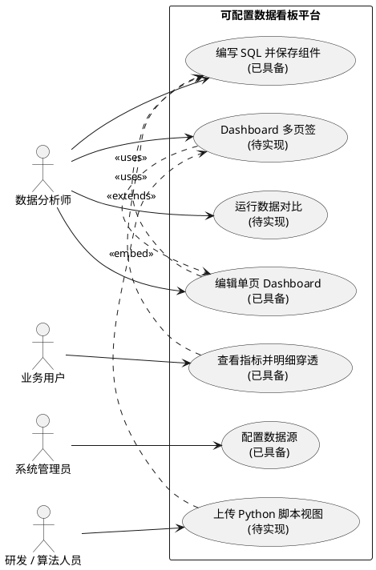
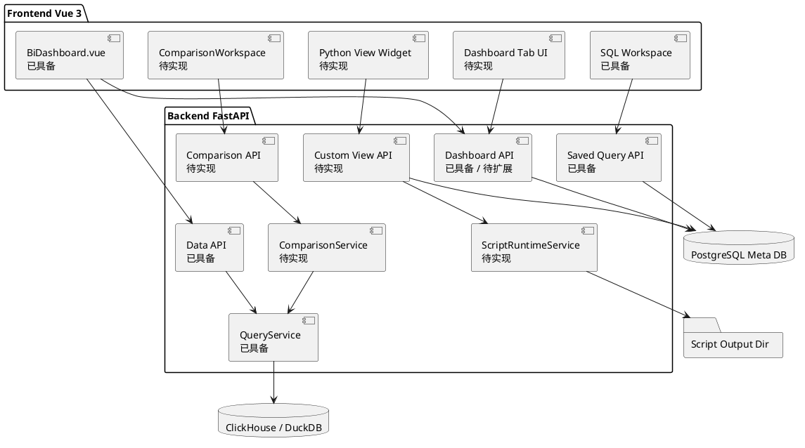

# 可配置数据看板平台设计文档

## 1. 需求背景 & 目标

### 1.1 背景
当前产业数字化建设对数据看板的要求已经从“固定报表交付”转向“可配置、可复用、可扩展”的自助式分析平台。业务部门在经营分析、财务核算、供应链监控、研发流水线度量等场景中，都需要快速把数据源、指标口径、图表展示和明细追踪组织成稳定看板。

传统开发模式下，每遇到一个新业务场景，研发团队往往需要重新开发一套页面、接口、SQL 查询和图表渲染逻辑。即使底层能力相似，也会因为数据源、指标口径、展示布局和交互方式不同而重复投入。长期看，这会带来几个明显痛点：

- **交付周期长**：新增一个看板往往要经过需求沟通、接口开发、页面开发、联调和验收，无法快速响应业务变化。
- **重复建设严重**：不同场景重复实现数据连接、SQL 查询、图表渲染、导出、下钻等通用能力。
- **指标口径难沉淀**：SQL、宏变量、阈值规则和图表配置分散在代码里，复用和追溯成本高。
- **运维和迭代成本高**：每个定制页面都可能形成独立维护面，后续调整布局、增加指标或切换版本时需要研发介入。
- **脚本资产难上平台**：部分指标已由本地 Python 脚本沉淀，例如流水线多次运行结果折线图，但缺少统一的上传、运行和看板展示入口。

因此，本项目的设计目标是建设一个可配置数据看板平台：通过数据源配置、SQL 查询组件、拖拽式 Dashboard、智能明细穿透和扩展视图机制，把大量重复开发工作转化为配置化工作。

### 1.2 版本口径
本文档按提交时间划分能力边界：

- **4 月提交作为已具备能力基线**：多数据源、SQL 工作台、查询固化、单页 Dashboard、图表渲染、智能下钻、宏变量、阈值高亮、Excel 导出、分页、性能优化、DuckDB 支持等均作为当前已有能力描述。
- **5 月提交和新增诉求作为待实现能力**：数据对比、Dashboard 多页签、自定义 Python 脚本视图统一作为下一阶段需要实现的能力进行方案设计。

### 1.3 目标
- 以 4 月版本为基础，说明当前平台已经具备的可配置看板底座能力。
- 设计下一阶段能力：数据对比、Dashboard 多页签、自定义 Python 脚本视图。
- 明确核心流程、合理的视图分析、接口设计和测试用例，便于后续研发落地。
- 用高保真图片描述关键页面和交互形态，降低产品、研发、测试之间的理解偏差。

### 1.4 高保真总览


---

## 2. 需求整体分析

### 2.1 用户与场景

| 用户 | 当前痛点 | 平台能力 |
| :--- | :--- | :--- |
| 数据分析师 | 新场景需要重复写页面和接口，SQL 口径难复用 | 通过 SQL 工作台固化查询组件，复用宏变量、阈值和图表配置 |
| 业务用户 | 报表分散，无法按主题组织或快速查看明细 | 通过 Dashboard 聚合指标，点击聚合指标进行明细穿透 |
| 系统管理员 | 数据源连接和页面交付依赖研发维护 | 通过配置中心管理数据源，降低硬编码连接配置 |
| 数据质量 / 核算人员 | 缺少标准化结果对比工具，差异定位依赖手工查数 | 待实现数据对比，支持 baseline / target 对齐和明细定位 |
| 研发 / 算法人员 | 本地 Python 指标脚本难以给业务稳定查看 | 待实现 Python 脚本视图，上传脚本后在 Dashboard 中展示 PNG 产物 |

### 2.2 竞品对比

| 维度 | Superset | Grafana | Metabase | Streamlit / 脚本平台 | 本项目设计定位 |
| :--- | :--- | :--- | :--- | :--- | :--- |
| 数据源接入 | 丰富，平台级能力强 | 强，偏监控和时序 | 简单易用 | 依赖开发者实现 | 已具备 ClickHouse / DuckDB 配置化接入 |
| SQL 自助分析 | 强 | 中 | 强 | 取决于代码 | 已具备 SQL 工作台、宏变量和查询固化 |
| Dashboard 编排 | 成熟 | 成熟 | 中等 | 通常要写代码 | 已具备单页拖拽看板，待实现多页签 |
| 明细下钻 | 有，但依赖配置 | 以链接和面板跳转为主 | 有限 | 自定义实现 | 已具备基于 sqlglot 的智能明细穿透 |
| 数据对比 | 非核心能力 | 非核心能力 | 非核心能力 | 可写代码实现但不标准 | 待实现独立数据对比工作区 |
| Python 脚本视图 | 不面向本地脚本上传 | 可通过外部图或插件绕接 | 不直接支持 | 原生适合脚本 | 待实现上传脚本、统一运行、PNG 入看板 |
| 适用重点 | 通用 BI | 运维监控 | 轻量自助分析 | 快速代码应用 | 面向内部业务场景，把重复开发转化为配置 |

### 2.3 设计结论
- 当前平台已经具备“可配置数据看板底座”：数据源、SQL、图表、Dashboard、下钻和导出。
- 下一阶段重点不是重做通用 BI，而是补齐业务场景复用能力：多页签组织、跨版本结果对比、脚本视图纳管。
- 数据对比和 Python 脚本视图应独立建模，避免污染 Saved Query 的单 SQL 组件假设。
- 自定义 Python 执行必须定义输入、输出、日志、超时和文件限制，不能简单等同于任意代码执行。

---

## 3. 流程分析

### 3.1 已具备主流程：从数据源到可配置看板
1. 管理员在配置中心新增 ClickHouse 或 DuckDB 数据源。
2. 分析师在 SQL 工作台选择数据源，加载物理表列表。
3. 分析师编写 SQL，可配置 `{{version}}` 等宏变量，执行后查看表格或图表预览。
4. 分析师将 SQL 保存为查询组件，组件记录数据源、SQL、宏变量、阈值规则和图表类型。
5. 用户创建 Dashboard，把查询组件添加为 Widget。
6. Dashboard 进入编辑模式后可拖拽、缩放、删除 Widget；保存后进入阅读模式。
7. 业务用户点击聚合指标或图表点位，打开智能明细穿透弹窗。
8. 用户可导出查询结果、Widget 数据或下钻明细。

### 3.2 待实现流程：Dashboard 多页签


1. 用户打开 Dashboard 后进入默认页签。
2. Dashboard 顶部展示业务页签，例如销售概览、渠道表现、区域排行、异常预警。
3. 阅读模式下只能切换页签；编辑模式下可以新增、重命名、删除、复制和排序页签。
4. 每个页签维护独立的 Widget 布局。
5. 保存当前页签布局时，不覆盖其他页签。
6. 旧单页 Dashboard 第一次升级时生成默认页签，原有 Widget 保持可见。

### 3.3 待实现流程：数据对比


1. 用户创建对比配置，填写对比 SQL、baseline 宏变量、target 宏变量、主键列、分组列和对比标准。
2. 后端分别执行 baseline 和 target SQL。
3. 服务按主键对齐两侧结果，重复 key 直接拒绝。
4. 服务按分组和标准统计一致、不一致、baseline 缺失、target 缺失和一致率。
5. 前端展示汇总表，汇总表只做展示分页，不改变统计口径。
6. 用户点击汇总计数字段，按分组、标准和状态分页查看明细。
7. 单侧结果超过 `100000` 行时，后端拒绝执行并提示用户先聚合或缩小 SQL 范围。

### 3.4 待实现流程：自定义 Python 脚本视图


1. 用户将本地已有 Python 脚本做少量规范化改造。
2. 用户上传脚本文件或脚本目录，填写入口命令和参数模板。
3. 平台使用统一 Python 环境执行脚本，并注入运行参数和输出目录。
4. 脚本生成 `$OUTPUT_DIR/main.png`，可选生成 `$OUTPUT_DIR/result.json`。
5. 平台记录运行状态、耗时、stdout、stderr、错误信息和产物路径。
6. Dashboard 新增 Python 视图 Widget，展示最近一次成功运行的 PNG。
7. 用户可在 Widget 中手动刷新运行，也可查看运行日志。

---

## 4. 视图分析

### 4.1 场景视图


### 4.2 逻辑视图


### 4.3 进程视图
```plantuml
@startuml
participant "Browser" as Browser
participant "FastAPI" as API
participant "QueryService" as Query
participant "ComparisonService\n待实现" as Compare
participant "ScriptRuntimeService\n待实现" as Script
database "PostgreSQL" as Meta
database "Business DB" as Biz
folder "Output Dir" as Out

Browser -> API : POST /api/v1/data/query/raw
API -> Query : raw_query(sql, macros)
Query -> Biz : execute SQL
Biz --> API : columns/data/total
API --> Browser : 表格或图表数据

Browser -> API : POST /api/v1/data/compare
API -> Compare : run(config)
Compare -> Query : baseline SQL
Compare -> Query : target SQL
Compare --> API : summary/detail index
API --> Browser : 对比汇总

Browser -> API : POST /api/v1/custom-views/scripts/{id}/runs
API -> Script : run command with params
Script -> Out : write main.png/result.json
Script -> Meta : save run record
API --> Browser : run status + artifact url
@enduml
```

### 4.4 部署视图
- 前端：Vue 3 SPA，使用 Element Plus、ECharts、vue3-grid-layout、ExcelJS。
- 后端：FastAPI + Python 3.9，本地 `.venv` 提供服务运行环境。
- 元数据：PostgreSQL，当前保存数据源、查询组件、Dashboard 和 Widget；待扩展对比配置、Dashboard Tab、Python 脚本和运行记录。
- 业务数据源：ClickHouse / DuckDB，通过 `DataSourcePort` 适配。
- Python 脚本视图：待实现，复用统一 Python 环境执行，产物写入后端受控输出目录，再通过接口返回给前端。

---

## 5. 功能实现方案

### 5.1 已具备能力基线：4 月提交

#### 数据源配置
- 支持 ClickHouse / DuckDB 数据源配置。
- 后端通过 `x-data-source-id` 加载连接配置并实例化适配器。
- 前端支持新增、编辑、删除数据源，并在工作台按数据源加载表列表。

#### SQL 分析工作台
- 支持原生 SQL 查询和结果预览。
- 支持 `{{macro}}` 形式宏变量，后端在 AST 解析前做字符串级白名单替换。
- 支持查询结果表格分页，分页选项为 10、20、50，默认 10。
- 支持 ECharts 表格、柱状图、折线图、饼图预览。
- 支持保存查询组件、更新当前查询、另存为新查询。

#### 单页 Dashboard
- 支持创建 Dashboard。
- 支持将 Saved Query 添加为 Widget。
- 支持拖拽、缩放、移除 Widget，并保存布局。
- 支持 Dashboard 阅读模式和编辑模式分离，避免业务查看时误拖拽。
- 支持 Dashboard 级宏变量聚合和刷新。
- 支持大数据表格使用 `shallowRef` / `shallowReactive` 降低 Vue 深层代理开销。

#### 图表和样式
- 支持表格、柱状图、折线图、饼图。
- 支持阈值高亮、区间条件和字体颜色自适应。
- 支持 Excel 导出，并尽量保留阈值高亮样式。

#### 智能明细穿透
- 后端使用 sqlglot 解析原始 SQL。
- 支持从聚合结果穿透到底层明细。
- 支持多表 JOIN 场景继承原始 JOIN 子句。
- 支持 `COUNT(DISTINCT)` 场景，通过 ClickHouse `LIMIT 1 BY` 返回去重实体明细。
- 明细弹窗支持分页并保留过滤条件和宏变量。

### 5.2 待实现能力一：Dashboard 多页签

#### 设计目标
- 让同一个 Dashboard 可以按业务主题拆分为多个页面。
- 避免单画布承载过多 Widget 导致信息拥挤。
- 保持旧 Dashboard 兼容，降低迁移成本。

#### 数据模型
新增 `dashboard_tabs`：

| 字段 | 类型 | 描述 |
| :--- | :--- | :--- |
| `id` | Integer | Tab 主键 |
| `dashboard_id` | Integer | 所属 Dashboard |
| `name` | String(255) | 页签名称 |
| `sort_order` | Integer | 页签排序 |
| `created_at` | DateTime | 创建时间 |

调整 `dashboard_widgets`：

| 字段 | 类型 | 描述 |
| :--- | :--- | :--- |
| `dashboard_tab_id` | Integer | 所属 Tab |
| `dashboard_id` | Integer | 兼容旧数据 |

#### 交互方案
- Dashboard 标题下方增加页签栏。
- 阅读模式只允许切换页签。
- 编辑模式支持新增、重命名、删除、复制和排序页签。
- 添加图表默认添加到当前页签。
- 保存布局时只保存当前页签 Widget。
- 旧看板无页签时，自动展示“默认页签”。

### 5.3 待实现能力二：数据对比

#### 设计目标
- 支持同一 SQL 在 baseline / target 两组宏变量下运行并比较结果。
- 支持按主键对齐、按分组汇总、按标准比较字段。
- 支持查看差异明细和导出汇总结果。

#### 数据模型
新增 `comparison_configs`：

| 字段 | 类型 | 描述 |
| :--- | :--- | :--- |
| `id` | Integer | 对比配置主键 |
| `name` | String | 对比名称 |
| `data_source_id` | Integer | 关联数据源 |
| `raw_sql` | Text | baseline / target 共用 SQL |
| `baseline_macros` | JSON | baseline 宏变量 |
| `target_macros` | JSON | target 宏变量 |
| `key_columns` | JSON | 主键列 |
| `group_columns` | JSON | 分组列 |
| `criteria` | JSON | 对比标准 |
| `max_rows` | Integer | 单侧安全阈值，默认 100000 |

#### 计算方案
- baseline 和 target 分别调用 `QueryService.raw_query()`。
- 单侧结果超过 `max_rows` 时拒绝执行。
- 按 `key_columns` 建立索引，发现重复 key 直接返回错误。
- 对每个 key 和每个 criterion 计算一致、不一致或缺失。
- 汇总维度为 `group_columns + criterion_name`。
- 明细接口按分组、标准、状态分页返回。

### 5.4 待实现能力三：自定义 Python 脚本视图

#### 设计目标
- 支持把本地已有 Python 指标脚本上传到平台。
- 用户只做少量规范化改造即可把脚本产物展示到 Dashboard。
- 平台统一执行脚本，记录日志和产物，不要求前端执行任意代码。

#### 脚本规范
```text
1. 平台通过入口命令启动脚本，例如：python main.py --date {{date}}
2. 平台向脚本注入环境变量 OUTPUT_DIR。
3. 脚本必须将主视图保存为 $OUTPUT_DIR/main.png。
4. 脚本可选输出 $OUTPUT_DIR/result.json。
5. result.json 可包含 title、description、generated_at、metrics、warnings。
```

示例 `result.json`：

```json
{
  "title": "流水线收入趋势",
  "description": "按多次流水线运行结果生成的收入折线图",
  "generated_at": "2026-05-14T10:32:00+08:00",
  "main_artifact": "main.png"
}
```

#### 数据模型
新增 `custom_view_scripts`：

| 字段 | 类型 | 描述 |
| :--- | :--- | :--- |
| `id` | Integer | 脚本主键 |
| `name` | String | 脚本名称 |
| `entry_command` | Text | 入口命令模板 |
| `params_schema` | JSON | 参数定义 |
| `script_path` | Text | 上传后的脚本目录 |
| `created_at` | DateTime | 创建时间 |

新增 `custom_view_runs`：

| 字段 | 类型 | 描述 |
| :--- | :--- | :--- |
| `id` | Integer | 运行记录主键 |
| `script_id` | Integer | 所属脚本 |
| `status` | String | pending / running / success / failed / timeout |
| `params` | JSON | 本次运行参数 |
| `stdout` | Text | 标准输出 |
| `stderr` | Text | 标准错误 |
| `artifact_path` | Text | `main.png` 路径 |
| `result_meta` | JSON | `result.json` 内容 |
| `started_at` | DateTime | 开始时间 |
| `finished_at` | DateTime | 结束时间 |

Dashboard Widget 扩展：
- `widget_type`: `saved_query` 或 `custom_python_view`。
- `query_id`: 保存 SQL 组件时使用。
- `custom_view_script_id`: Python 视图时使用。
- `custom_view_run_id`: 最近一次成功运行记录，可为空。

#### 执行约束
- 统一使用后端 Python 环境，不做每脚本独立 venv。
- 入口命令只允许在上传脚本目录内执行。
- 注入固定输出目录，执行前清理本次运行目录。
- 设置超时时间，默认 60 秒。
- 限制 `main.png` 文件大小，例如最大 20 MB。
- 捕获 stdout / stderr，失败时前端展示日志。
- Dashboard 默认展示最近一次成功产物。

---

## 6. 接口设计

### 6.1 已具备接口

| 方法 | 路径 | 说明 |
| :--- | :--- | :--- |
| `GET` | `/api/v1/data/meta/tables` | 获取当前数据源表列表 |
| `GET` | `/api/v1/data/meta/columns/{table_name}` | 获取表字段 |
| `POST` | `/api/v1/data/query/raw` | 执行原生 SQL |
| `POST` | `/api/v1/data/drill-through` | 执行智能明细穿透 |
| `POST` | `/api/v1/data/drill-down` | 执行聚合下钻 |
| `GET/POST/PUT/DELETE` | `/api/v1/data-sources` | 数据源 CRUD |
| `GET/POST/PUT/DELETE` | `/api/v1/saved-queries` | 查询组件 CRUD |
| `GET/POST/PUT/DELETE` | `/api/v1/dashboards` | Dashboard CRUD |

### 6.2 待实现接口：Dashboard 多页签

#### 查询 Dashboard 聚合
`GET /api/v1/dashboards/{dashboard_id}`

响应新增 `tabs`：

```json
{
  "id": 1,
  "name": "经营分析大屏",
  "description": "管理层经营看板",
  "tabs": [
    {
      "id": 11,
      "name": "销售概览",
      "sort_order": 1,
      "widgets": []
    }
  ]
}
```

#### 创建页签
`POST /api/v1/dashboards/{dashboard_id}/tabs`

```json
{
  "name": "渠道表现",
  "sort_order": 2
}
```

#### 更新页签
`PUT /api/v1/dashboards/{dashboard_id}/tabs/{tab_id}`

```json
{
  "name": "区域排行",
  "sort_order": 3
}
```

#### 保存页签布局
`PUT /api/v1/dashboards/{dashboard_id}/tabs/{tab_id}/widgets`

```json
{
  "widgets": [
    {
      "widget_type": "saved_query",
      "query_id": 12,
      "x": 0,
      "y": 0,
      "w": 6,
      "h": 8,
      "i": "1710000000000"
    }
  ]
}
```

### 6.3 待实现接口：数据对比

| 方法 | 路径 | 说明 |
| :--- | :--- | :--- |
| `GET` | `/api/v1/comparisons` | 查询对比配置列表 |
| `POST` | `/api/v1/comparisons` | 创建对比配置 |
| `PUT` | `/api/v1/comparisons/{id}` | 更新对比配置 |
| `DELETE` | `/api/v1/comparisons/{id}` | 删除对比配置 |
| `POST` | `/api/v1/data/compare` | 运行对比并返回汇总 |
| `POST` | `/api/v1/data/compare/detail` | 分页查询对比明细 |

`POST /api/v1/data/compare` 请求：

```json
{
  "config": {
    "name": "订单版本对比",
    "data_source_id": 1,
    "raw_sql": "SELECT id, country, revenue FROM orders_{{version}}",
    "baseline_macros": { "version": "v1" },
    "target_macros": { "version": "v2" },
    "key_columns": ["id"],
    "group_columns": ["country"],
    "criteria": [
      { "name": "金额一致性", "column": "revenue", "mode": "strict_equal", "tolerance": 0 }
    ],
    "max_rows": 100000
  }
}
```

### 6.4 待实现接口：自定义 Python 脚本视图

#### 上传脚本
`POST /api/v1/custom-views/scripts`

请求类型：`multipart/form-data`

| 字段 | 说明 |
| :--- | :--- |
| `name` | 脚本视图名称 |
| `entry_command` | 入口命令模板 |
| `params_schema` | 参数定义 JSON |
| `archive` | 脚本压缩包或单文件 |

#### 运行脚本
`POST /api/v1/custom-views/scripts/{script_id}/runs`

```json
{
  "params": {
    "date": "2026-05-14"
  }
}
```

#### 查询运行结果
`GET /api/v1/custom-views/runs/{run_id}`

```json
{
  "id": 1001,
  "script_id": 1,
  "status": "success",
  "artifact_url": "/api/v1/custom-views/runs/1001/artifact/main.png",
  "stdout": "plot saved",
  "stderr": "",
  "result_meta": {
    "title": "流水线收入趋势",
    "generated_at": "2026-05-14T10:32:00+08:00"
  }
}
```

#### 获取产物
`GET /api/v1/custom-views/runs/{run_id}/artifact/main.png`

返回 `image/png`。

---

## 7. 测试用例设计

### 7.1 已具备能力回归测试

| 用例 | 操作 | 预期 |
| :--- | :--- | :--- |
| BASE-01 数据源新增 | 新增 ClickHouse 或 DuckDB 数据源 | 保存成功，可加载表列表 |
| BASE-02 SQL 查询 | 输入合法 SQL 并运行 | 返回 columns/data/total |
| BASE-03 宏变量替换 | SQL 使用 `{{version}}` | 后端按宏变量替换后执行 |
| BASE-04 保存查询 | 保存 SQL、图表类型、阈值 | `saved_queries` 记录完整配置 |
| BASE-05 Dashboard 布局 | 添加 Widget、拖拽缩放并保存 | 刷新后布局保持 |
| BASE-06 表格分页 | 工作台或 Widget 切换页码 | 请求携带正确 limit 和 offset |
| BASE-07 图表下钻 | 点击图表点位或聚合单元格 | 弹出明细穿透弹窗 |
| BASE-08 Excel 导出 | 导出查询或 Widget | Excel 可打开，阈值样式保留 |

### 7.2 Dashboard 多页签测试

| 用例 | 操作 | 预期 |
| :--- | :--- | :--- |
| TAB-01 默认兼容 | 打开旧单页看板 | 自动展示默认页签，原组件可见 |
| TAB-02 新增页签 | 新增并命名页签 | 页签栏出现新页签，画布为空 |
| TAB-03 独立布局 | 两个页签分别添加不同组件 | 切换页签时布局互不影响 |
| TAB-04 保存当前页签 | 只保存当前页签布局 | 其他页签不被覆盖 |
| TAB-05 删除保护 | 只剩一个页签时删除 | 前端禁止或后端拒绝 |
| TAB-06 复制页签 | 复制已有页签 | 新页签拥有相同初始布局，可独立编辑 |

### 7.3 数据对比测试

| 用例 | 操作 | 预期 |
| :--- | :--- | :--- |
| CMP-01 完全一致 | baseline 和 target 指向同一版本 | 不一致和缺失均为 0 |
| CMP-02 值不一致 | 构造同 key 不同值 | 不一致数增加，明细展示差值 |
| CMP-03 单侧缺失 | 构造 baseline-only 和 target-only | 分别计入 target 缺失和 baseline 缺失 |
| CMP-04 分组汇总 | 配置分组列 | 每个分组独立统计 |
| CMP-05 重复 key | 任一侧出现重复主键 | 后端拒绝并提示重复 key |
| CMP-06 超过上限 | 单侧结果超过 100000 行 | 后端拒绝并提示先聚合或缩小范围 |
| CMP-07 汇总分页 | 汇总超过 50 行 | 前端分页展示，统计口径不变 |
| CMP-08 汇总导出 | 汇总表有多页时导出 | 导出完整汇总，不只是当前页 |

### 7.4 自定义 Python 脚本视图测试

| 用例 | 操作 | 预期 |
| :--- | :--- | :--- |
| PY-01 上传脚本 | 上传包含入口文件的脚本包 | 生成脚本记录 |
| PY-02 成功运行 | 入口命令生成 `$OUTPUT_DIR/main.png` | 状态为 success，可在 Dashboard 展示图片 |
| PY-03 参数注入 | 配置 `date` 参数并运行 | 命令模板正确替换参数 |
| PY-04 输出缺失 | 脚本未生成 `main.png` | 状态 failed，提示输出产物缺失 |
| PY-05 运行超时 | 脚本超过超时时间 | 状态 timeout，保留日志 |
| PY-06 大文件限制 | 生成超大 PNG | 后端拒绝产物并标记失败 |
| PY-07 Dashboard 刷新 | 在 Widget 点击刷新运行 | 新运行成功后图片更新 |
| PY-08 依赖缺失 | 脚本依赖统一环境中不存在 | 运行失败并展示 stderr |

---

## 8. 风险与约束

- 当前文档以 4 月版本为已具备基线；5 月数据对比代码虽然在仓库中存在，但在本文档口径下仍作为下一阶段待实现能力描述。
- Dashboard 多页签和 Python 脚本视图涉及元数据结构演进，实际实现时必须同步更新 `metadata_schema.md` 和 `4_plus_1_views.md`。
- Python 脚本复用统一环境，依赖冲突和资源占用风险高于容器隔离方案，需要依靠超时、输出目录限制、文件大小限制和日志审计降低风险。
- 自定义脚本运行不应获得元数据库写权限，也不应直接修改平台源码目录。
- 如果未来从统一 Python 环境演进到隔离执行环境，需要重新设计依赖安装、网络访问、资源配额和产物管理。

---

## 9. 默认假设

- 本文档用于指导后续实现，不代表所有待实现能力已经上线。
- 高保真设计图以 SVG 图片形式存放在 `my_design/assets/` 并嵌入本文档。
- 自定义 Python 脚本视图默认输出 PNG，Dashboard 直接展示最近一次成功产物。
- Python 脚本统一运行在后端 Python 环境中，不做每脚本独立 venv。
- 脚本需要少量适配，至少遵守入口命令、`OUTPUT_DIR` 和 `main.png` 输出约定。
